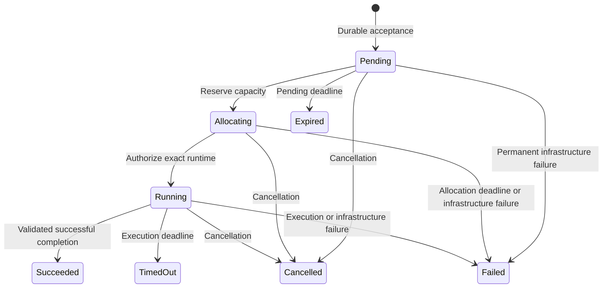

# ADR 0002: Task lifecycle

- Status: Accepted
- Date: 2026-09-20
- Depends on: [ADR 0001](0001-authoritative-task-state.md)

## Context

Tasks must survive control-plane restarts without repeating user code or losing
results. Keep ADR 0001's PostgreSQL authority, S3 payload storage, and single
reconciler. Agent Sandbox is the only production provider; local execution is
for trusted development code. Hardened isolation remains outside v0.1.

## Decision

### States and transitions

`Pending` waits for capacity. `Allocating` holds capacity while creating a runtime
that cannot yet execute code. `Running` means authorized, covering preparation,
execution, and result publication; it does not prove user code started.

Dispatch and authorization require no cancellation and an unexpired phase
deadline. All transitions obey the event precedence below. `Succeeded`, `Failed`,
`Cancelled`, `Expired`, and `TimedOut` are terminal and immutable. `Failed`
distinguishes execution from infrastructure errors. Rejection creates no task;
cancellation intent, receipts, capacity, and cleanup are separate facts.

Transitions check state and version and append history atomically. Capacity
changes lock admission before the task. External calls stay outside transactions.
Sample PostgreSQL time after acquiring locks; task versions order events with
equal timestamps.

### Execution and deadlines

Persist allocation intent and a deterministic name before runtime creation.
Resolve uncertain creates by that identity and verify ownership. Never adopt a
different UID or replace a lost allocation.

Before fetching source or preparing inputs, the runtime requests authorization.
One transaction changes `Allocating` to `Running`, binds the resource UID and
runtime boot identity, and sets the execution deadline. Only that request gets
a one-use start permit after an acknowledged commit. An uncertain commit sends
no permit; later reads cannot recreate one. Lost replies and runtime or Pod
restarts never receive another permit. Established start uncertainty becomes an
infrastructure failure subject to the event precedence below.

Phase budgets start at acceptance (`Pending`), capacity reservation (`Allocating`),
and authorization (`Running`). Execution includes preparation, uploads, and the
completion receipt. Retries never reset deadlines.

The runtime independently enforces its budget using elapsed time from before its
authorization request, including latency and suspension. It drains bounded logs
and stops the process tree, including children surviving parent exit. An early
deadline stop waits for the database deadline to establish `TimedOut`, subject
to event precedence. Client disconnects do not cancel tasks.

### Completion and cancellation

After uploading logs and artifacts, the runtime publishes an immutable manifest
and submits its reference and digest as a PostgreSQL **completion receipt**.
New receipt acceptance requires `Running`, the authorized resource and boot
identity, no cancellation, and an unexpired execution deadline. While task
metadata is retained, identical retries return the original receipt even after
cancellation, deadline, or completion; conflicts cannot replace it. Cancel and
timeout reports are partial results, not eligible receipts.

The reconciler resolves an eligible receipt by validating its manifest and
referenced objects. Success requires a zero user-code exit, completed required
transfers, and compliance with output limits. Valid evidence of a nonzero exit
or an output-limit violation produces execution failure. Invalid or unverifiable
evidence produces infrastructure failure. Validation retries last 60 seconds
from receipt acceptance, followed by one final bounded read; restart cannot reset
this window. After a lost S3 write response, verify the stored digest; a
conditional-write conflict does not prove identical contents.

Without an eligible receipt, cancellation, expiration, timeout, and established
infrastructure failure can be finalized from durable intent and validated
observations without a manifest, following this precedence.

Cancellation records its first intent durably and returns the current task.
Repeated requests change neither intent nor outcome. Apply events in this order:

1. Preserve a terminal outcome.
2. Resolve an eligible completion receipt, including validation failure.
3. Honor cancellation recorded before the current phase deadline.
4. Apply the phase deadline: `Expired`, allocation failure, or `TimedOut`.
5. Apply an established failure; otherwise continue.

A new receipt or cancellation recorded at the deadline cannot preempt it.
Earlier eligible receipts and timely cancellation retain their priority after
the deadline. Versions order receipt and cancellation events with equal
timestamps. Cancellation requests a stop; it neither proves termination nor
undoes effects. Late validated partial results may be exposed while retained
without changing outcome or retention.

### Capacity and recovery

Reserve capacity at dispatch. Release it only when allocation requests are
resolved, all allocated runtimes and children have stopped, and the provider
cannot recreate them. Terminal outcomes, missing Pods, and successful delete
requests are insufficient. Uncertain reservations remain visible for operator
resolution and never expire automatically.

At metadata expiration, atomically transfer unfinished cleanup, including any
unreleased capacity, to a tombstone. Admission counts task and tombstone
reservations. Payload deletion waits for logical expiration and the stop
conditions above, accounting for delayed uploads before declaring completion.

Restart resumes observation and cleanup from durable state, never a start
permit. Detected lock loss stops new mutations and dispatch and removes readiness;
it does not fence transactions on other connections or in-flight external calls.
Shutdown must not invoke SDK cleanup that deletes running task resources. Local
recovery verifies process identity beyond a PID. Database restore requires
ADR 0001's audit: preserve terminal outcomes, follow event precedence, and never
rerun uncertain work or infer timely completion from a manifest alone.

## Tradeoffs and amendments

At most one attempt can mean no execution after a lost authorization reply.
Uncertain termination can block capacity until operator resolution. These costs
preserve execution and admission guarantees without a retry engine or node fencing.

This ADR amends the requirements and ADR 0001 in two areas:

- **Completion receipt:** without a timely receipt, even a successfully uploaded
  result can time out during a control-plane outage. This replaces the previous
  publication-only completion rule and narrows success recovery after restore.
- **Retention accounting:** capacity held in cleanup tombstones remains counted
  after task metadata expires, replacing task-row-only admission counts.

Preparation and finalization need no separate states. Runtime schemas and
authentication require separate designs; [ADR 0003](0003-task-store.md) defines
the storage layout and transactions.

## Essential acceptance cases

- Retrying a lost acceptance reply with the same retained idempotency key and
  request returns the same task; without a key, a retry may create another task.
- Concurrent admission and dispatch cannot exceed their respective limits.
- Lost create or start replies, restarted runtimes, and reused resource names
  cannot cause a second attempt or premature capacity release.
- Cancellation, completion, and deadlines follow the ordering above, including
  equal timestamps and database lock waits.
- Successful code with missing or conflicting outputs cannot become success;
  a timely receipt survives restart and late validation.
- Delayed creates, unreachable nodes, surviving child processes, and metadata
  expiration preserve capacity until execution is confirmed stopped.
