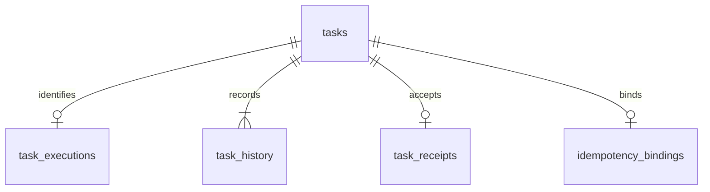
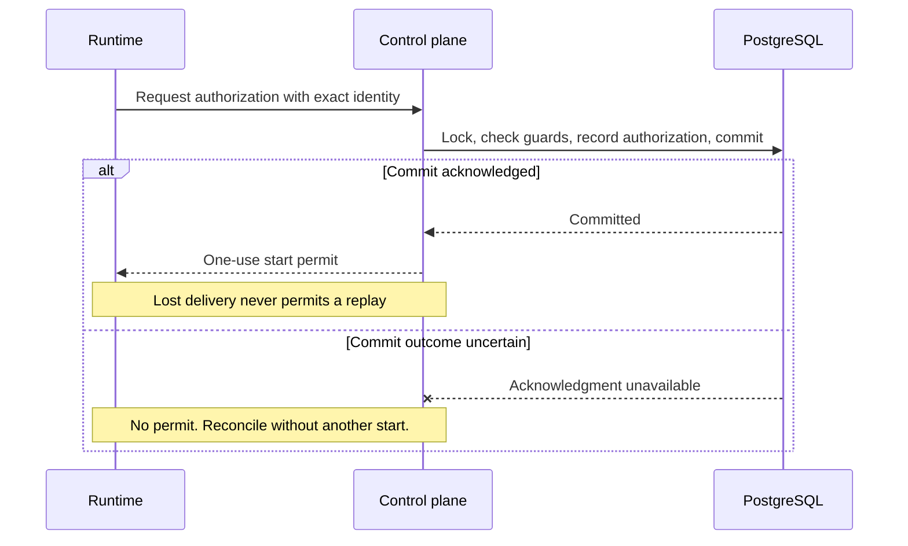

# ADR 0003: PostgreSQL task store

- Status: Accepted
- Date: 2026-09-20
- Depends on: [ADR 0001](0001-authoritative-task-state.md) and [ADR 0002](0002-task-lifecycle.md)

## Context

ADRs 0001 and 0002 define task authority and lifecycle. This ADR defines storage
records, atomic operations, and migrations. The Go task model is a domain
projection, not a database schema. Implementation and operations are described
in the [task-store guide](../task-store.md).

## Records

v0.1 uses one database per deployment with one task-store schema, typed columns
for queryable facts, and S3 for payloads. Map records explicitly; never serialize
the entire `task.Task`.

| Record | Key and contents |
| --- | --- |
| `tasks` | Application-generated UUID; state and version, source and specification references and protocol versions, requested timeout and effective limits, timestamps and phase deadlines, cancellation and authorization times and versions, allocation reference, authorized boot identity, outcome, retention, and reconciliation schedule |
| `task_executions` | Task ID; provider, runtime protocol version, deterministic allocation name, resource kinds, namespace, ownership markers, and observed claim, Sandbox, and Pod UIDs |
| `task_history` | Task ID and task version; event kind, database time, previous and next state, and bounded reason code |
| `task_receipts` | Task ID; immutable execution and boot identity, manifest reference and SHA-256, acceptance time and version, fixed validation deadline; mutable validation status, attempts, next attempt, and bounded failure code |
| `idempotency_bindings` | SHA-256 key digest; canonicalization version, request digest, and unique task ID |
| `admission` | One fixed row used as a lock; no stored counters |
| `cleanup_tombstones` | Original task ID; remaining owned references, provider identity, unresolved intent, reservation, cleanup version, stop evidence, retry schedule, and bounded errors |

Children reference the task and are deleted with it. Expired bindings may be
removed earlier for key reuse. Tombstones have no task foreign key and retain
unfinished cleanup after task deletion; they are not public task records.

Execution identity fields are filled once. The provider, namespace, resource
kind, and allocation name tuple is unique; never replace an allocation or UID.
History appends facts and transitions, not payloads or snapshots. Bindings store
no raw key and expire with task metadata.

Capacity and cleanup occupy a separate version group on `tasks`:
`cleanup_version`, `capacity_held`, allocation-resolution and stop facts,
provider-teardown evidence, release time, payload-expiration and completion
markers, remaining references, and retry state. Transfer this group and provider
identity to a tombstone at metadata deletion if cleanup remains unfinished.
There is no separate capacity table.

Use positive `bigint` versions, `timestamptz`, integer microsecond durations,
32-byte `bytea` digests, and nullable unknown facts. Reject integer overflow and
normalize Go timestamps and durations to database precision before decisions.
Database constraints enforce valid states, nonnegative sizes, and consistency
between terminal state and outcome; domain code enforces transitions.

Object references include location, key, size, checksum, and version or ETag.
Bounded, versioned JSONB holds only client metadata, effective limits, and object
reference collections—never source, logs, credentials, presigned URLs, or raw
provider objects.

Index due nonterminal tasks by `(next_reconcile_at, id)`, pending tasks, held
reservations in both owning tables, retention deadlines, and due cleanup.
Work scans are bounded hints, not claims; workers reload current facts.

## Transactions and versions

Use short `READ COMMITTED` transactions on the primary, explicit row locks,
`fsync = on`, and `synchronous_commit = on`. Acknowledged commits must reach
durable WAL; failover and backup loss remain subject to ADR 0001's recovery point
objective. External calls stay outside transactions.

Keep ADR 0001's dedicated session advisory lock. It coordinates the single
control-plane process; it neither replaces row checks nor fences transactions
on other connections or external requests already in flight. On detected lock
loss, stop new mutations and dispatch and remove readiness.

Acquire locks in this order: `admission`, tasks by ID, their children, then
tombstones by ID. Omit admission only when counts cannot change. Never acquire
it after a task lock; restart if the required lock set changes. Receipt and
execution writers lock the parent even when no child exists.

After locking, read current facts and sample `clock_timestamp()` once in a
separate statement for decisions, history, and derived deadlines. Do not use
transaction-start `now()`, client time, or a sample preceding a lock wait.
Count admission usage in a fresh statement after taking its lock.

| Operation | Atomic work |
| --- | --- |
| Accept | Recheck idempotency, enforce pending capacity, insert task, optional binding, and initial history after external payload staging |
| Dispatch | Enforce active capacity, record allocation intent, reserve capacity, and append transition before provider creation |
| Authorize or accept receipt | Check identity, state, version, cancellation, and deadline; persist related facts and history |
| Release capacity | Verify allocation resolution, stopped runtimes and children, and inability to recreate them; clear reservation and advance cleanup version |
| Expire metadata | Transfer unfinished cleanup and reservation to a tombstone, then delete task and children under admission; count the reservation exactly once |

Admission counts `Pending` rows and held reservations in tasks plus tombstones.
Leaving `Pending` takes the admission lock; becoming terminal never releases
capacity. Under this lock, expired bindings may be removed without discarding
the old task's cleanup. Resolve retained bindings before current policy,
admission, and external input checks, and recheck at acceptance.

Lifecycle writes update only owned columns with
`WHERE id = $id AND state = $expected_state AND task_version = $expected_version`,
advance the version once, and append history atomically. Zero affected rows
roll back all writes, including children and history. Reload and reevaluate
stale decisions with fresh database time.

Receipt validation shares the task version. Cleanup compares expected state and
`cleanup_version` on tasks, or only `cleanup_version` on tombstones; it changes
neither task version nor outcome. Dispatch advances both versions. Adding owned
references to cleanup during receipt processing also advances cleanup version
in the same transaction. Domain capacity helpers and history slices do not
define the storage layout; append only new history.

Terminal writes atomically record retention deadlines from current operator
policy, with payload retention no longer than metadata retention. Outcomes and
recorded retention deadlines never change. Public reads enforce logical expiration
even if physical deletion is delayed. Read aggregates in one statement or under
a parent lock to avoid mixing revisions.

Documented no-ops, including repeated cancellation and identical receipts, use
current retained facts and change neither version nor history. Expiry retries
resume tombstone cleanup without recreating a task or reservation.

## Authorization and receipts

Authorization requires `Allocating`, no prior authorization, exact execution
identity, and ADR 0002's cancellation and deadline guards. Persist boot identity,
execution deadline, authorization, version, and history before responding.

Only the request with the acknowledged new commit may send the permit. A domain
flag, SQL `RETURNING` row, or later read cannot recreate it, even for the same boot
identity. Never retry authorization across an ambiguous commit. A known rollback
allows a retry with fresh guards and database time.

For receipts, lock the task and check retention and existing evidence first.
Identical execution identity, boot identity, manifest reference, and digest return
the original receipt even after cancellation, deadline, or completion. Conflicts
never replace it. With no receipt, require `Running`, matching authorization,
no cancellation, and database time before the execution deadline; check expected
state and version, then atomically insert, advance task version, and append
history. The unique task key permits only one receipt.

Validation's retry deadline is fixed at receipt acceptance plus 60 seconds,
followed by ADR 0002's final bounded read. Retries and restarts never extend the
window. Unlike a start permit, a committed receipt can answer a retry after a
lost commit acknowledgment.

## Migrations and restore

Use numbered immutable SQL migrations and a `schema_migrations` ledger recording
version, checksum, and application time. Stop API writers and reconciliation,
then migrate explicitly with a separate DDL role and the deployment advisory lock.
Each migration and ledger entry commit together; nontransactional DDL needs a
later design.

The binary declares supported PostgreSQL versions and an exact schema version.
Readiness rejects unsupported servers, incompatible schemas, or inconsistent
ledger versions and checksums. There are no startup migrations, mixed-version
writers, or automatic down migrations. Ledger checks do not detect arbitrary
manual DDL; application roles must not own or alter the schema.

A rolled-back migration preserves its starting version; earlier committed
migrations in the same run remain applied. If commit acknowledgment is lost,
inspect the ledger before retrying. After an incompatible upgrade, use a
compatible binary or verified backup; never edit the ledger to simulate rollback.

Preserve versions, identities, authorization, receipt timing, deadlines,
reservations, and idempotency digests across upgrades and backups. Retained
canonicalization versions and immutable specification, manifest, and runtime
protocol versions must remain supported. Reject incompatible upgrades before
migration; never rewrite immutable objects or reinterpret existing digests.

Restore schema and ledger together with a compatible binary. Complete ADR 0001's
external-resource audit before readiness. Restore never replays history, renews
deadlines, clears capacity, or recreates permits. Preserve terminal outcomes and
apply ADR 0002's event precedence to nonterminal tasks. A manifest cannot replace
lost execution identity, authorization, or timely receipt evidence.

## Consequences and verification

Explicit mappings and two version groups avoid whole-row overwrites and event
replay. The admission lock intentionally serializes capacity changes in v0.1.

Require real PostgreSQL tests for competing admissions, stale updates and history
rollback, authorization commit uncertainty, identical and conflicting receipts,
deadlines crossed during lock waits, atomic tombstone transfer, and migration and
restore failure. Restore coverage includes every lifecycle stage and tombstones
with held reservations. In-memory tests cannot establish these guarantees;
database restore tests alone cannot validate Kubernetes or S3 recovery.

PostgreSQL references: [isolation](https://www.postgresql.org/docs/current/transaction-iso.html),
[locking](https://www.postgresql.org/docs/current/explicit-locking.html),
[database time](https://www.postgresql.org/docs/current/functions-datetime.html), and
[commit durability](https://www.postgresql.org/docs/current/runtime-config-wal.html).
